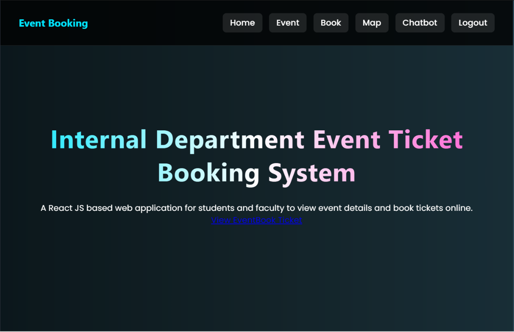
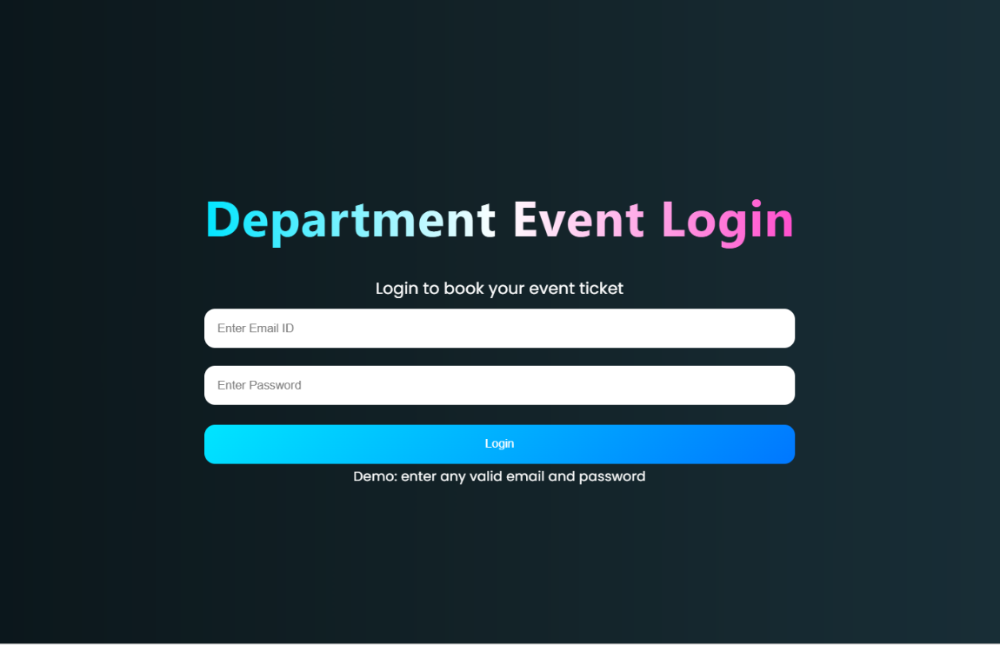
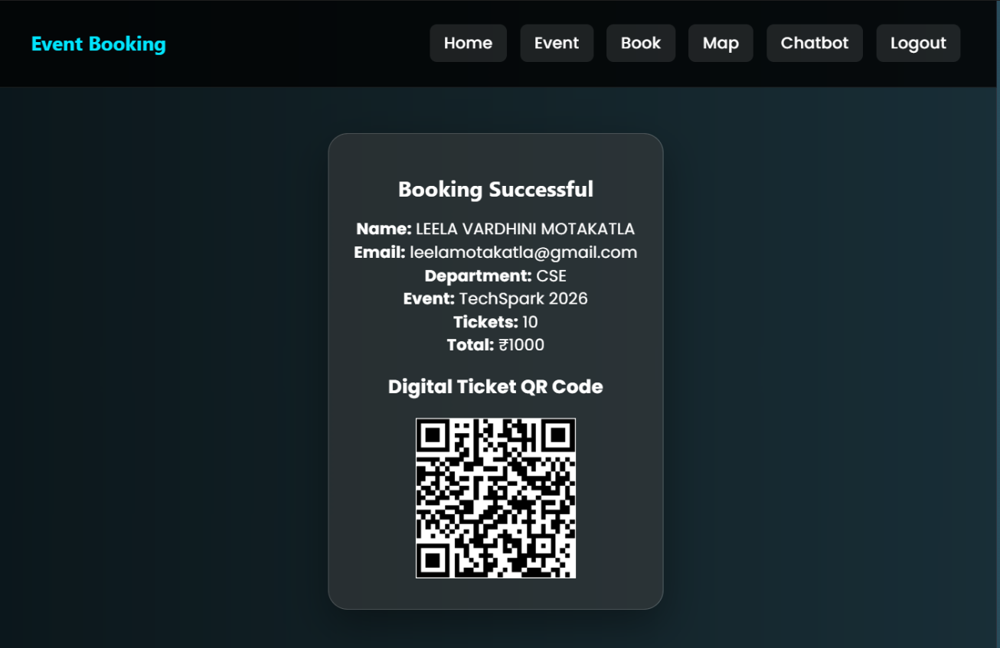
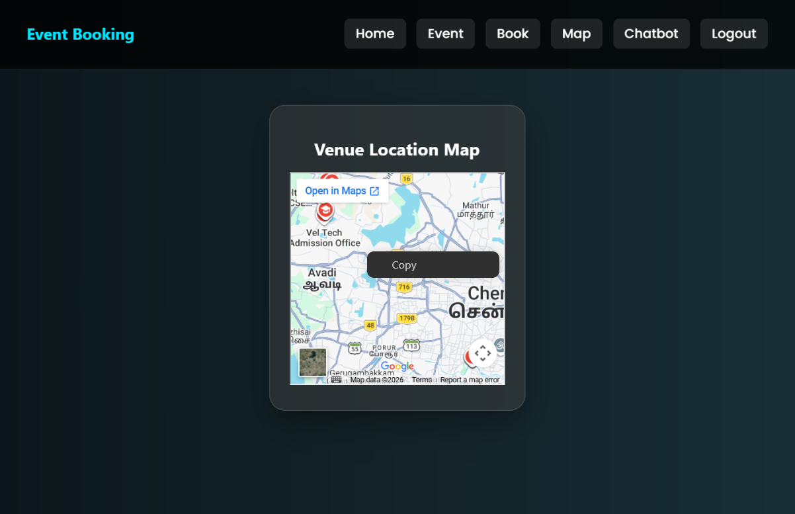
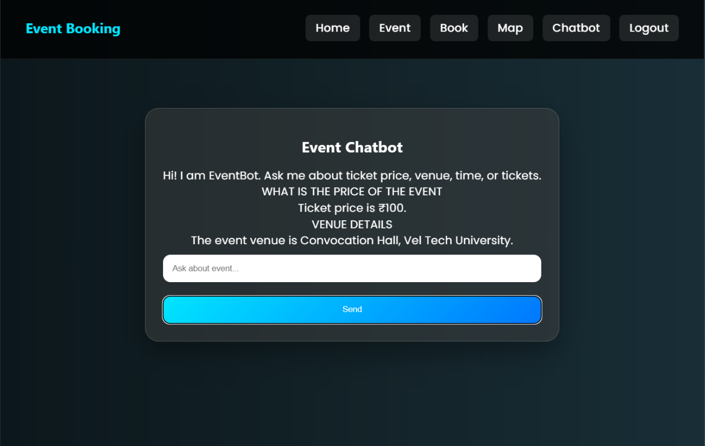

# 🎟️ Event Ticket Booking System

<p align="center">
  
  
  
  
  
  
  
</p>

---

# 📌 Overview

The **Event Ticket Booking System** is a modern and responsive web application built using **React** and **Vite**. It enables users to browse events, view event details, book tickets, generate QR-based digital tickets, access venue maps, and interact with a chatbot for assistance.

The project demonstrates modern frontend development practices through reusable React components, responsive UI design, modular architecture, and efficient client-side navigation.

---

# 🛠️ Tech Stack

### Frontend
- React.js
- Vite
- JavaScript (ES6+)
- HTML5
- CSS3

### Tools
- VS Code
- Git
- GitHub
- npm

---

# ✨ Features

- 🎉 Browse upcoming events
- 📄 View detailed event information
- 🎫 Book event tickets
- ✅ Booking confirmation
- 🎟️ QR code ticket generation
- 🗺️ Venue map integration
- 🤖 Interactive chatbot
- 📱 Fully responsive design
- ⚡ Fast loading with Vite
- 🧩 Reusable React components

---

# 🚀 Installation

### Clone the Repository

```bash
git clone https://github.com/yourusername/event-ticket-booking-system.git
```

### Navigate to the Project

```bash
cd event-ticket-booking-system
```

### Install Dependencies

```bash
npm install
```

### Start the Development Server

```bash
npm run dev
```

### Build for Production

```bash
npm run build
```

---

# 📸 Project Screenshots

### 🏠 Home Page

<p align="center">

</p>

### 🔐 Login Page

<p align="center">

</p>

### ✅ Booking Confirmation

<p align="center">

</p>

### 🗺️ Event Venue Map

<p align="center">

</p>

### 🤖 Chat Assistant

<p align="center">

</p>

---

# ⚙️ Functional Modules

| Module | Description |
|---------|-------------|
| 🏠 Home | Displays featured events and navigation |
| 🎉 Events | Browse and view event details |
| 🎫 Booking | Ticket booking and quantity selection |
| ✅ Confirmation | Displays booking confirmation |
| 🎟️ QR Ticket | Generates digital QR tickets |
| 🗺️ Venue & Chat | Venue map and chatbot assistance |

---

# 🔮 Future Enhancements

- Backend integration with Spring Boot
- User authentication & authorization
- Payment gateway integration
- Seat selection system
- Booking history
- Admin dashboard
- Event management panel
- Email notifications
- Search and filtering
- Dark mode support

---

# 👩‍💻 Author

**Motakatla Leela Vardhini**

🎓 B.Tech – Computer Science and Engineering

Apspiring Software Developer
---

# 📄 License

This project is licensed under the **MIT License**.

If you found this project useful, consider giving it a ⭐ on GitHub.